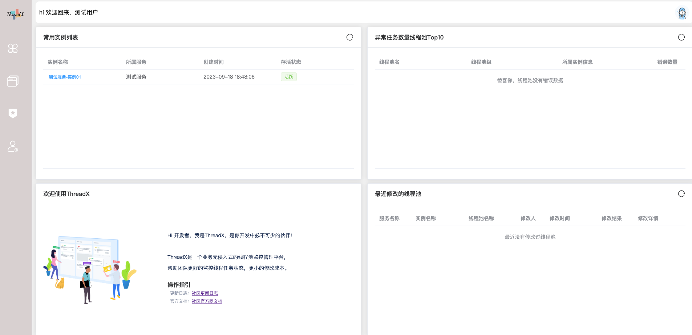
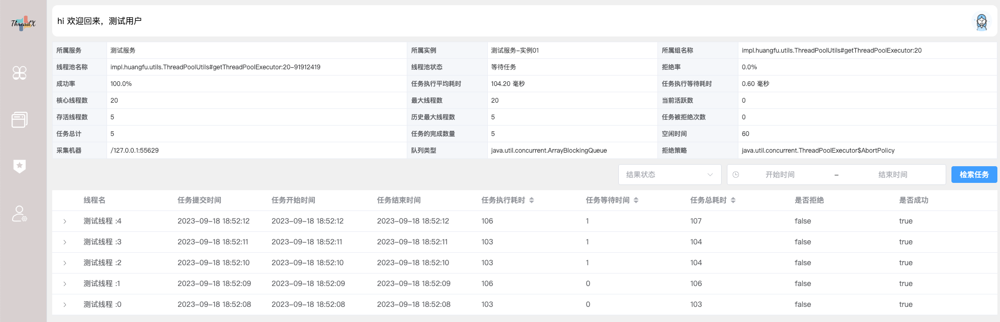
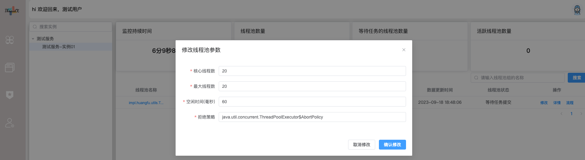

## 最新发布(2023/09/18)

我们很高兴的宣布ThreadX v1.0 发布。请查询[发行说明](https://github.com/huangfuProject/threadX/tree/main)

## 关于ThreadX
> ThreadX是一个用java/Vue编写的业务代码无侵入性的轻量级的线上环境线程池的监控、修改于一体的工具。

我们在日常学习过程中可以接触到各种各样的线程池调优参数，然而，由于公司业务的复杂性和特殊性，我们很难找到一个完全符合自己业务的线程池参数公式。这可能导致在线上环境中线程池参数设置不恰当，进而引发各种故障。面对这种情况，我们通常需要重新评估业务规模，调整线程池参数，然后重新发布应用。这个过程不仅耗时，而且成本高昂。因此，我们需要一种更加灵活和高效的解决方案来降低修改线程池参数的成本。

正是基于这样的思考，ThreadX应运而生。ThreadX不仅可以帮助我们快速调整线程池参数以适应线上环境的变化，还可以在发生故障时提供快速的恢复能力。ThreadX可以自动调整线程池的参数设置，以适应不同的业务场景和负载情况。此外，ThreadX还可以提供实时的监控功能，帮助我们及时发现并解决潜在的故障风险。

通过使用ThreadX，我们可以减少重新发布应用的次数，降低维护成本，并提高系统的可用性和稳定性。ThreadX为我们提供了一种更加完善的解决方案，使我们能够更好地应对公司业务复杂性和规模不断增长带来的挑战。

## 概述

随着计算机行业的飞速发展，摩尔定律逐渐失效，多核CPU成为主流。因此，使用多线程并行计算逐渐成为开发人员提升服务器性能的基本武器。线程池是一种通过“池化”思想，帮助我们管理线程而获取并发性的工具。但是，如何合理地设置线程池的参数，使其更好地利用有限的资源为系统提供服务，是每个开发人员必须掌握的基本功！

ThreadX提供了完整的线程池数据采集功能以及一组完整的UI页面，使得开发人员能够对当前程序运行过程中产生的任务执行资源消耗、线程池的使用程度有一个直观的认识！通过直观地观察UI页面，开发人员可以更好地了解任务执行的情况，以及线程池的使用情况，从而更好地调整线程池的参数，提高服务器的性能。此外，ThreadX还提供了一系列完整的监控功能，能够及时发现任务执行过程中的异常情况，确保程序运行的稳定性和可靠性。

提供了一组对于线程池执行的任务的详细监控

提供可一组针对于线上线程池的实时参数修改

## 入门
